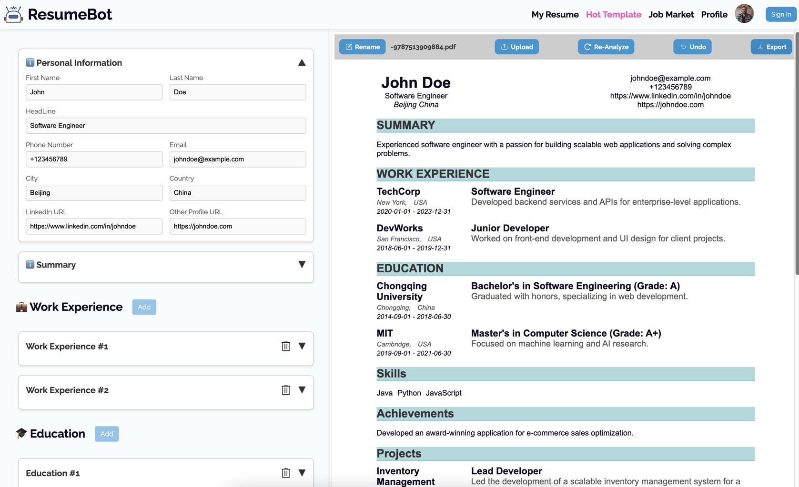
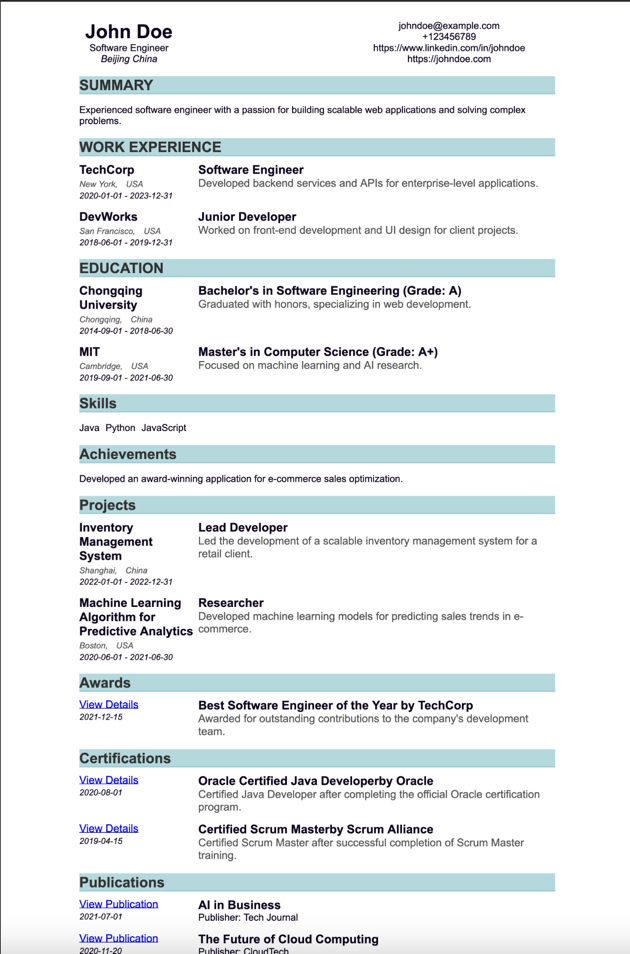

# Resume-Modifier-FrontEnd

一个简历修改器的前端部分

## 页面预览如下:



## 生成pdf如下:



- 处理pdf使用了 html2pdf
- 需要在container的样式中添加

    ```css
    .resume-container {
    page-break-inside: avoid;
    break-inside: avoid;
    }
    ```
    防止文字被上下截断
## TODO
- 删除功能
- 组件化
- 实现undo
- 实现 re-analysis
